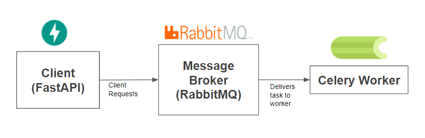

# FastAPI App with Celery, RabbitMQ, Flower, and Docker

## Tech Stack

- **[FastAPI](https://fastapi.tiangolo.com/)**
- **[Celery](https://docs.celeryq.dev/en/stable/)**
- **[RabbitMQ](https://www.rabbitmq.com/documentation.html)**
- **[Flower](https://flower.readthedocs.io/en/latest/)**
- **[Docker](https://www.docker.com/)**

## Project Structure

```
my-fastapi-app/
├── app/
│   ├── __init__.py
│   ├── main.py
│   └── tasks.py
├── docker-compose.yml
├── Dockerfile
├── requirements.txt
├── README.md
└── diagram.png
```

## Setup

1. **Clone the Repository**

   ```bash
   git clone https://github.com/akileshjayakumar/my-fastapi-app
   cd my-fastapi-app
   ```

2. **Build and Start Containers**

   ```bash
   docker compose up --build
   ```

## Usage

1. **Access FastAPI Documentation**

   Open [http://localhost:8000/docs](http://localhost:8000/docs) in your browser to explore the interactive API docs.

2. **Submit a Task**

   - **Via Browser or Postman**:
     - **Endpoint**: `POST http://localhost:8000/add/{a}/{b}`
     - **Example**: `POST http://localhost:8000/add/3/4`

3. **Check Task Status**

   - **Via Browser or Postman**:
     - **Endpoint**: `GET http://localhost:8000/result/{task_id}`
     - **Example**: `GET http://localhost:8000/result/<task_id>`

4. **Monitor Tasks with Flower UI**

   Open [http://localhost:5555](http://localhost:5555) in your browser to view real-time monitoring of Celery tasks.

## Architecture Diagram


